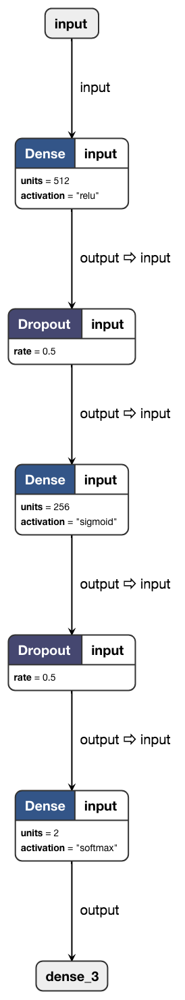

# Twitter sentiment analysis


### Dataset used
[Thinkbook](http://thinknook.com/wp-content/uploads/2012/09/Sentiment-Analysis-Dataset.zip)

### How to Use
```
pip3 install -r requirements.txt
python useit.py
```

## Self.blog

I used this network architecture




On 5th epoch , validation accuracy came out as 79.36 %


It took me around ~ 3 hour to train the model .
This project is quite simple and interesting. Here are some examples that I tested.


Input a twit to be evaluated  :  `My deep learning model is working so fine`


`positive sentiment 91.65% confidence `

Input a twit to be evaluated  :  `I love fashion`

`positive sentiment 91.50% confidence`

Input a twit to be evaluated  :  `i don't want this to  happen again`

`negative sentiment 90.93% confidence `


### Developer

<table>
<tr>
<td>
    

        Amit Kumar

<p align="center">
<a href = "https://github.com/amit2rockon"></a>
<a href = "https://twitter.com/amit2rockon7"></a>
<a href = "https://www.linkedin.com/in/amit2rockon/"></a>
</p>
</td>
</tr>
</table>


Want to contribute?
Just raise an issue and Give PR !